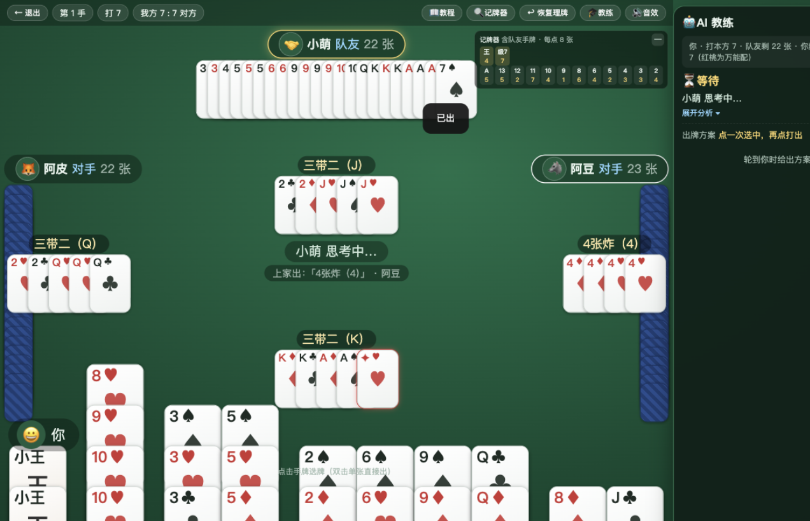
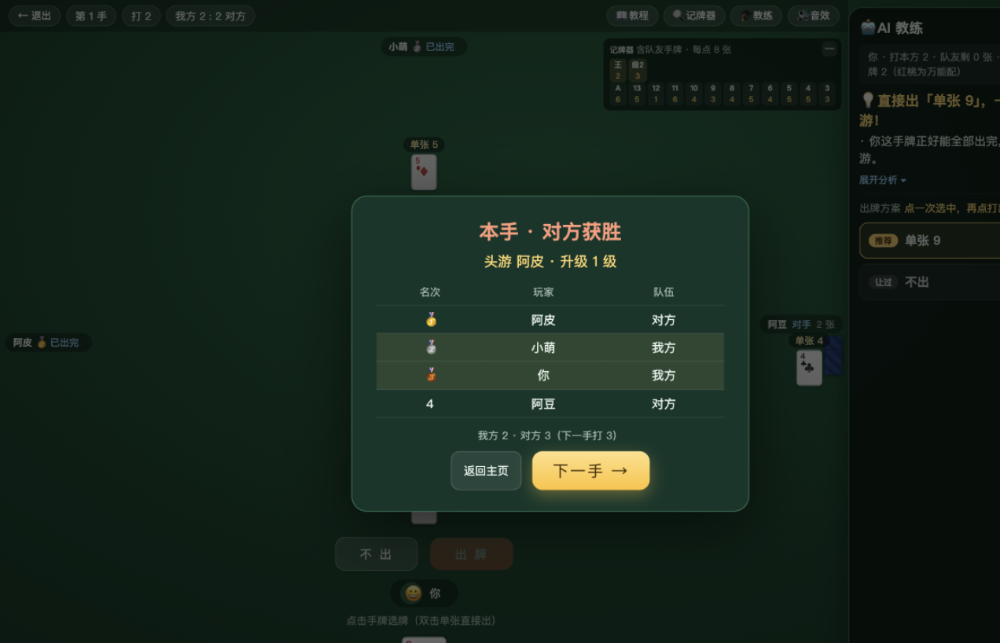
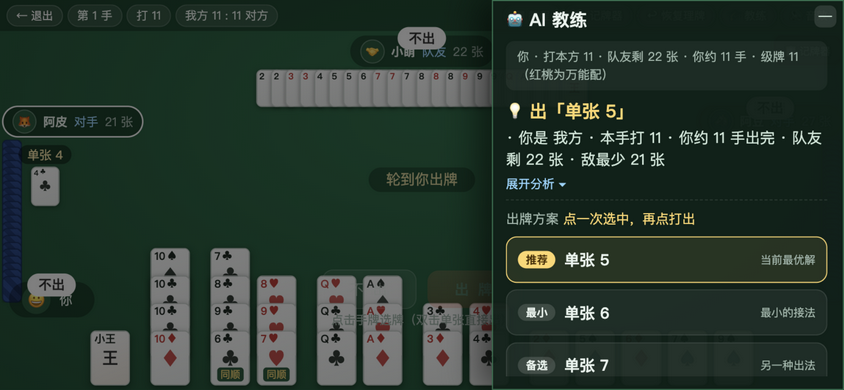

# 🃏 掼蛋 AI 训练营（掼蛋大师）

一个帮助**零基础玩家从第一局开始学会掼蛋**的网页游戏：完整真实的掼蛋对局（两副牌 · 4 人两两组队 · 从 2 打到 A），每次轮到你出牌时，**AI 教练**给出出牌方案和通俗的理由讲解；对手 BOT 分三档难度。纯前端、零依赖、零构建，双击即玩。



## 🚀 运行方式

**方式一（最简单）**：直接双击打开 `index.html` 即可玩（已验证 file:// 协议可用）。

**方式二（本地服务器）**：
```bash
# 任意一种
npx http-server -p 8642 -c-1     # 然后访问 http://127.0.0.1:8642
python3 -m http.server 8642
```

**运行测试**（需要 Node.js）：
```bash
node test/sim.js
# 39 项逻辑断言（牌型/压制链/万能配/走法/教练/收轮与接风回归）
# + 3 难度 × 20 手 4-BOT 对局仿真 + 1 场"从 2 打到过 A"整场升级验证
```

## ✨ 功能

| 模块 | 说明 |
|---|---|
| 完整掼蛋流程 | 两副牌 108 张（27×4 全发、无底牌）→ 级牌（打几）→ 轮流出牌/接风 → 头游定名次 → 升级制（双上+3 / 头游三游+2 / 头游末游+1）→ 过 A 获胜 |
| 🎓 AI 教练侧边栏 | 局势概览 + 可折叠中文分析 + **可点选方案列表**（推荐恒第一；两段式：点一次选中、再点打出）；桌面停靠右侧，移动端为顶部"教练"开关控制的抽屉，打完自动收起 |
| 教学式纠错 | 选牌实时显示牌型与"是否压得上家"；非法牌型/压不过时用通俗中文解释；出牌按钮实时置灰 |
| 三档难度 BOT | 🐣 入门（会犯错）/ ⚔️ 进阶（拆牌、留炸弹、偶尔忍牌）/ 🔥 高手（最少手数拆解、队友让牌、对手报牌压制） |
| 学习辅助 | 内置新手教程（5 章节）、记牌器（含队友亮牌，可折叠，窄屏默认收起）、报牌红点（≤10 张）、接风提示气泡、**纵向智能理牌三模式**（智能理牌/花色理牌/按大小，顶栏 🔀 循环切换）、**锁牌**（右键/长按锁定，锁牌恒列牌堆最左单列）、跨场战绩统计（localStorage） |
| 结算展示 | 本手名次表（🥇🥈🥉 徽章）、**级牌推进图示**（如"我方 5 ➜ 8（+3 级）"）、整场过 A 弹窗+胜利彩带 |
| 交互增强 | 双击手牌单张直接出、键盘快捷键（空格=出牌 / P=不出 / Esc=重选）、"要不起"按钮脉动提醒、过牌气泡 |
| 多端适配 | 桌面（≥1025px）/ 窄屏抽屉 / 横屏手机紧凑档 / 超矮视口降级 / 竖屏旋转提示；手牌与对手扇形按视口动态压缩不溢出 |
| 动效与音效 | 出牌/炸弹动效、结算弹窗、胜利彩带；WebAudio 实时合成音效 20 种场景（发牌/出牌/炸弹/报牌/接风/名次/本手胜负/过 A 庆典/选牌/按钮/弹窗等）+ 循环背景音乐（music/bgm.mp3，常开，首次交互自动续播）；支持 prefers-reduced-motion |

## 🎮 玩法速览

- **组队**：你与正上方对家一队（对家亮牌），对抗左右两侧对手
- **级牌**：每手打一个点数（每场从 2 打起），红桃级牌是**逢人配**万能配（可补成除王外任意牌型）
- **牌型**：单张 / 对子 / 三同张 / 三带二（不带单）/ 顺子（恰 5 张，A2345 最小）/ 连对（≥3 对）/ 钢板（≥2 组三同张）/ 炸弹（4~8 张同点）/ 同花顺 / 四王炸
- **大小**：大王 > 小王 > 级牌 > A > K > … > 2；炸弹压普通牌，张数多压张数少
- **胜负**：头游方按队友名次升级，谁赢打谁的级牌；**本方头游且队友非末游**即过 A，先过 A 者赢下整场
- **接风**：头游最后一手无人压时，由对家队友接风继续出牌



## 📁 目录结构

```
guandan-master-glm/
├── index.html          # 页面结构（主页 / 4 人牌桌 / 教程 / 结算）
├── css/style.css       # 全部样式（卡牌纯 CSS 绘制，无图片资源）
├── js/
│   ├── rules.js        # 规则开关集中配置 + 级牌序/升级表（区域差异改这里）
│   ├── cards.js        # 两副牌 108 张生成、洗牌、排序
│   ├── combos.js       # 牌型识别 analyze（含逢人配）+ 压制比较 beats
│   ├── movegen.js      # 合法走法枚举（先手/跟牌，万能配受控展开）
│   ├── ai.js           # 手牌拆解估算、三档难度 BOT、高手决策 bestPlay
│   ├── advisor.js      # AI 教练：建议 + 中文讲解 + 方案生成 + 点评
│   ├── sfx.js          # WebAudio 合成音效（无音频素材，可开关）
│   ├── game.js         # 4 人 2 队对局状态机（名次/接风/升级/过 A，事件驱动）
│   ├── ui.js           # 4 座牌桌渲染与交互（选牌/教练侧栏/记牌器/结算）
│   └── app.js          # 主页、教程、自动演示与调试钩子
├── docs/ARCHITECTURE.md  # 架构决策文档（继续开发前先读它）
├── docs/img/           # 界面截图（README 与验收存档）
├── test/sim.js         # 逻辑断言 + 4-BOT 对局仿真 + 整场升级验证
├── PROGRESS.md         # 开发进度与交接（跨电脑继续开发先读它）
└── shots/              # 本地调试截图（gitignore，不入库）
```

## 🧠 AI 教练的实现

全部为**客户端启发式算法**（不调用任何外部 API，离线可玩）：

1. **手牌拆解**（`decomposeGuandan`）：把 27 张手牌拆成尽量少的"手数"，作为局势评估核心
2. **方案生成**（`buildPlans`）：先手/跟牌合法走法中挑出 1~6 个候选（推荐/最小/最大/炸弹/让过 徽章），推荐恒第一
3. **决策**（`bestPlay`）：能一手跑完直接赢 → 对手报牌时压制 → 队友的牌让行 → 炸弹看时机
4. 教练在决策之上输出**中文讲解**，并对你的每手出牌做对比点评

## ⚙️ 规则开关（js/rules.js）

掼蛋存在区域规则差异，全部集中在 `DD.RULES`：

| 开关 | 默认 | 说明 |
|---|---|---|
| `randomStartLevel` | `false` | 每场起始级牌随机（2~K）；默认 `false`——标准规则从 2 打起 |
| `a2345` | `true` | 顺子是否允许 A 作 1（A2345） |
| `jokerPair` | `false` | 双大王/双小王是否可作对子出 |
| `noJokerKicker` | `true` | 三带二所带对子是否禁止王对 |
| `backTo2OnFail3` | `true` | 打 A 连续三次未过是否退回 2 |
| `reportAt` | `10` | 报牌张数阈值（≤ 该张数须报牌，界面显示红点） |
| `gong` | `false` | 进贡/还贡/抗贡（**预留开关**，引擎与 UI 已留位，默认"头游先出"简化流程） |
| `showScore` | `true` | 结算展示升级/级牌推进信息 |

## 🔧 测试与调试钩子

- `index.html?autotest=autoplay`：全自动演示整场（人类座位由 AI 代打）
- `&side=1`：强制展开 AI 教练侧栏
- `?debug=1`：7 秒后输出主要元素包围盒（供自动化检查布局交叠）
- JS 运行错误显示在页面左下角红色浮层，便于自动化截图发现问题

## 📌 当前状态

逻辑层与表现层均已完成并通过验收（详见 [PROGRESS.md](PROGRESS.md)）。唯一预留未实现的大项：**进贡/还贡/抗贡**（`rules.gong` 开关已预留，默认关闭）。


